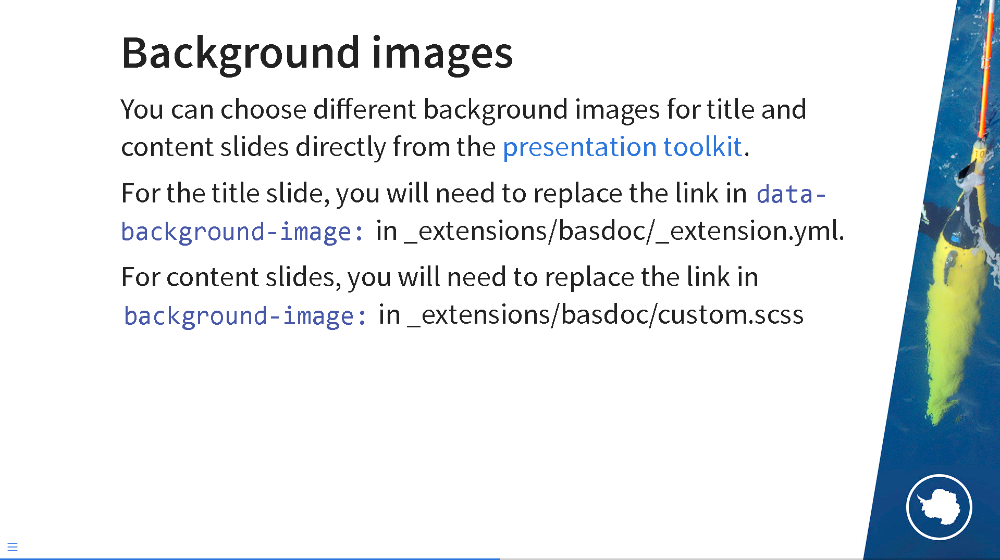

# Quarto BAS Theme

This is a template repository using `Quarto` `reveal.js`:


This is a minimal template intended to mimic the [Presentation Hub's PowerPoint guidance](https://nercacuk.sharepoint.com/sites/BASDigitalwmod-Communications/sitePages/PowerPointPresentationsToolkit.aspx).

It sets background images for the title and content slides, and refers to the BAS Style Kit CSS file, as per the [BAS Style Kit's Getting Started page](https://style-kit.web.bas.ac.uk/start/introduction/).

## Installing
### New Directory
``` bash
quarto use template antarctica/basdoc
```
This will install the extension in a new directory and create a `template.qmd` (automatically named after your new directory) file that you can use as a starting place for your presentation.

### Existing Directory
To add the extension to an existing directory, you can use:
``` bash
quarto add antarctica/basdoc
```
This will add the extension to an existing directory, but will not provide you with a `template.qmd` file. Note that you will need to update the YAML headers in your existing qmd files (or `_quarto.yml`) to refer to `basdoc-revealjs`, matching template.qmd:

```yaml
format:
  basdoc-revealjs: default
```

## Background images

You can choose different background images for title and content slides directly from the [presentation toolkit](https://nercacuk.sharepoint.com/sites/BASDigitalwmod-Communications/sitePages/PowerPointPresentationsToolkit.aspx).

To change the **title slide** image, in `_extensions/basdoc/_extension.yml` replace `data-background-image:`.

``` yaml
title-slide-attributes: 
  data-background-image: https://nercacuk.sharepoint.com/sites/basdigitalwmod-communications/creative%20services%20assets/ppt_title_halley.jpg
```

For **content slides**, in `_extensions/basdoc/custom.scss` replace `background-image:`

``` sass
/*-- scss:rules --*/
.slide-background-content{
  background-image: url("https://nercacuk.sharepoint.com/sites/basdigitalwmod-communications/creative%20services%20assets/ppt_page_glider01.jpg");
  background-size: 100% 100%
}
```



If you want to override the global content slide background, you can do so by specifying it in the slide title:

```md
## Content slides {background-image=https://nercacuk.sharepoint.com/sites/basdigitalwmod-communications/creative%20services%20assets/ppt_page_adelie01.jpg}
text
```

Note that images will only be displayed, if you have access to the [BAS Digital Workspace](https://nercacuk.sharepoint.com/sites/basdigitalwmod-whats-new).

## Using this as a GitHub repository template

This repository can also be used as a GitHub repository template. Click `Use this template` above to make a copy of it to your own account.

### Enabling GitHub actions and GitHub Pages

One benefit is using GitHub actions to automatically build the presentation as a GitHub pages website.

In your repository settings, enable GitHub Actions (if they aren't already) and Pages.

Under the **Actions** page in your repo's settings, under **Workflow permissions** enable "Read and Write Permissions".

Once the actions have run once and created the `gh-pages` branch, you can select it as your pages source under the **Pages** page.

Note that while your main presentation file might take one of a number of names (e.g. `template.qmd`, `your-directory-name.qmd` etc.), Github Pages will always look for `index.html` (the rendered version of `index.qmd`) for the landing page. You will need to rename your main presentation file to `index.qmd`, for your presentation to render on `your-organisation.github.io/your-repository`. For example, `template.qmd` will render on `your-organisation.github.io/your-repository/template.`

## Acknowledgements

Template created using [Quarto Creating Extensions \> Custom Formats](https://quarto.org/docs/extensions/formats.html#quick-start).

CSS Style sheets and guidance from [BAS Style Kit](https://style-kit.web.bas.ac.uk/).

Background images and guidance from [BAS Presentation Hub](https://nercacuk.sharepoint.com/sites/BASDigitalwmod-Communications/sitePages/presentation-hub.aspx).

Github Actions templating was adapted from David Wilby's [quarto-presentation-template](https://github.com/davidwilby/quarto-presentation-template).

This repository aims to provide a minimum template. Further customisation is up to the user, see [General Guidance on branding and logos](https://nercacuk.sharepoint.com/sites/BASDigitalwmod-Communications/sitePages/BrandingandLogos.aspx).
